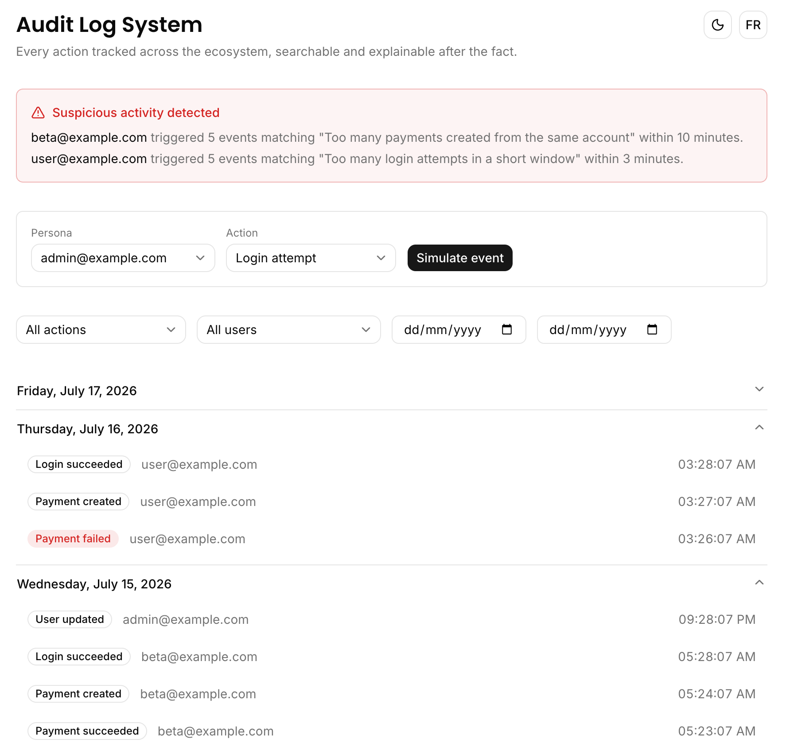
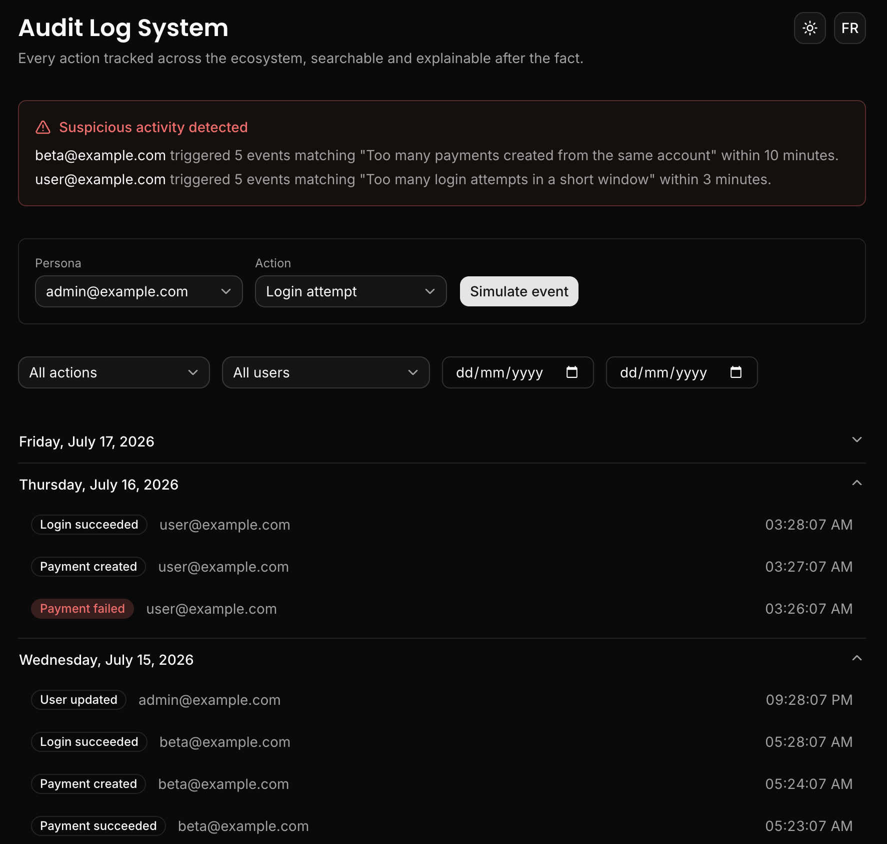
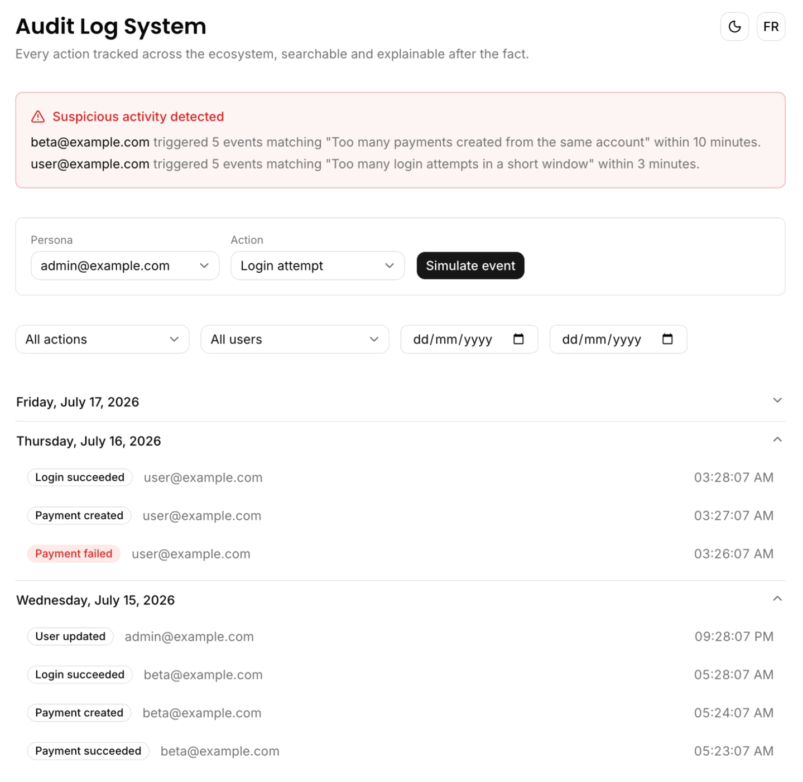

# Audit Log System

## Why this exists

Every serious production application has an audit log, yet it is one of the most requested features in real companies and one of the least well implemented in open source projects. This project is not another basic activity feed. It focuses on middleware-level logging, server-side pagination that scales, and suspicious activity detection.

The core idea: every sensitive action in the system should be traceable, searchable, and explainable after the fact.

## Features

- Centralized `logEvent()` function to record actions with actor, metadata, IP and user agent
- `withAuditLog()` wraps any business action to log its input, result and duration automatically, the "logging middleware" applied to actions instead of raw HTTP requests
- Timeline UI grouped by date as a collapsible accordion, Notion/Linear style
- Server-side keyset pagination, built to stay fast at any page depth
- Filtering by action, user and date range
- Action replay: inspect the exact input, result and duration behind a logged event in a detail dialog
- Suspicious activity detection (repeated login attempts, unusual payment volume) with a visual alert in the dashboard
- Action simulator to generate realistic demo events (login, payment, flag, user) without depending on the other ecosystem modules
- French/English language toggle
- Light/dark theme toggle (with interaction sounds)

## Tech stack

- Next.js (App Router)
- Supabase (`audit_logs` table)
- Tailwind CSS + Shadcn UI
- next-themes (dark/light mode)
- cuelume (interaction sounds)
- pnpm

## Screenshots / Demo GIF

Light mode:

Dark mode:

Simulating an event, opening the replay dialog, and toggling theme/language:

## How to reuse

1. Clone the repo and install dependencies: `pnpm install`
2. Add your Supabase credentials to `.env.local` (see `.env.example`)
3. Run `supabase/schema.sql` against your database to create the `audit_logs` table (it references the shared `users` table from `feature-flags-dashboard/supabase/schema.sql`)
4. Optionally run `supabase/seed.sql` to populate a few days of demo activity, including two suspicious bursts for the detector to catch
5. Run `pnpm dev`, then use the action simulator at the top of the dashboard to generate more events for any persona

## Architecture

- `lib/audit/log-event.ts` is the single entry point every module should call to write to `audit_logs`; it sanitizes metadata (`lib/audit/sanitize-metadata.ts`) so sensitive keys like `password` or `token` never reach the table
- `lib/audit/with-audit-log.ts` wraps a business action so its input, result (or error) and duration are captured and logged automatically, this is the "logging middleware" applied to actions instead of raw HTTP requests
- `lib/audit/queries.ts` reads the timeline with keyset pagination on `(created_at, id)`, which stays fast at any page depth unlike `OFFSET`
- `lib/audit/suspicious-activity.ts` slides a fixed time window over each user's recent events to flag rapid login attempts or payment bursts
- `lib/actions/simulate-audit-event.ts` is the server action behind the dashboard's action simulator; it routes to a per-domain simulator under `lib/actions/simulators/` (auth, payments, flags, users), each wrapped in `withAuditLog`, to exercise the whole pipeline without depending on the other ecosystem modules
- `lib/i18n/` holds `en.json`/`fr.json` dictionaries plus a formatter for the suspicious activity alerts
- `components/audit/timeline.tsx` groups logs by date into a shadcn Accordion; `event-row.tsx` renders the replay dialog on click
- `app/page.tsx` composes the filter bar, suspicious activity banner, action simulator and timeline, all server-rendered from the same Supabase read
